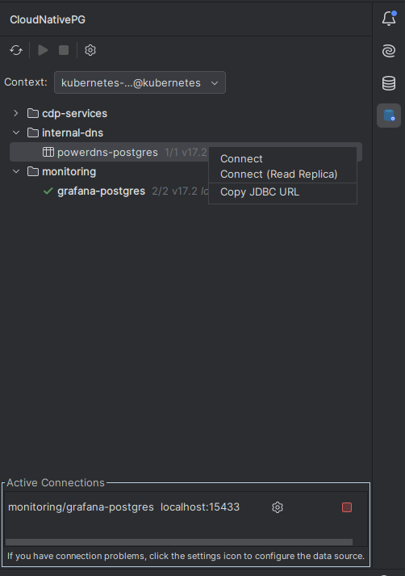
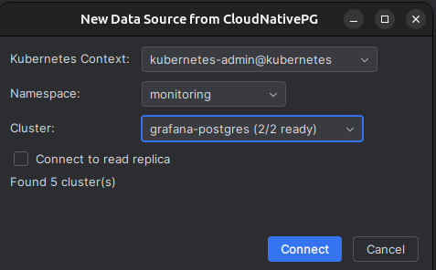

# CloudNativePG Connector for JetBrains IDEs

[](https://plugins.jetbrains.com/plugin/com.irulast.cloudnativepg)
[](LICENSE)

Connect to [CloudNativePG](https://cloudnative-pg.io/) PostgreSQL clusters running in Kubernetes directly from your JetBrains IDE. One click to discover clusters, establish secure connections, and start querying your databases.

<p align="center">
  
</p>

## Features

- **Automatic Discovery** - Finds all CloudNativePG clusters across namespaces in your Kubernetes contexts
- **One-Click Connect** - Establishes kubectl port-forwarding with a single click
- **Secure Credentials** - Automatically extracts credentials from Kubernetes secrets
- **Database Tools Integration** - Creates data sources in JetBrains Database Tools for full SQL support
- **Multi-Context Support** - Switch between Kubernetes contexts to access clusters in different environments
- **Primary & Replica Connections** - Connect to the primary instance or read-only replicas
- **Connection Management** - Automatically reconnects on IDE startup and cleans up when data sources are removed

## Installation

### From JetBrains Marketplace

1. Open your JetBrains IDE (IntelliJ IDEA Ultimate, DataGrip, PyCharm Professional, etc.)
2. Go to **Settings/Preferences** → **Plugins** → **Marketplace**
3. Search for "CloudNativePG Connector"
4. Click **Install** and restart your IDE

### Manual Installation

1. Download the latest release from the [Releases](https://github.com/irulast/cloudnativepg-intellij/releases) page
2. Go to **Settings/Preferences** → **Plugins** → **⚙️** → **Install Plugin from Disk...**
3. Select the downloaded `.zip` file and restart your IDE

## Requirements

- **JetBrains IDE** with Database Tools support (IntelliJ IDEA Ultimate, DataGrip, PyCharm Professional, GoLand, etc.)
- **kubectl** configured with access to your Kubernetes cluster(s)
- **CloudNativePG** operator installed in your Kubernetes cluster
- **RBAC permissions** to:
  - List and get CloudNativePG Cluster resources
  - Read Secrets (for database credentials)
  - Create port-forwards to Pods

## Quick Start

1. **Open the CloudNativePG tool window** from the right sidebar (or View → Tool Windows → CloudNativePG)

2. **Select your Kubernetes context** from the dropdown

3. **Browse your clusters** organized by namespace

4. **Connect to a cluster**:
   - Double-click a cluster to connect to the primary
   - Right-click for options including "Connect (Read Replica)"

5. **Start querying** - The database appears in Database Tools, ready to use

<p align="center">
  
</p>

## Usage

### Connecting to a Cluster

When you connect to a cluster, the plugin:

1. Discovers the cluster's pods and services
2. Extracts credentials from the associated Kubernetes secret
3. Establishes a kubectl port-forward to the PostgreSQL service
4. Creates a data source in Database Tools with the correct connection details
5. Opens the Properties dialog for you to verify and save the connection

### Managing Connections

- **Active Connections Panel** - Shows all active port-forwards with their local ports
- **Configure Button** - Opens Database Tools properties if you need to troubleshoot
- **Disconnect Button** - Stops the port-forward and removes the connection

### Auto-Reconnect

When you restart your IDE, the plugin automatically:
- Detects data sources it previously created
- Re-establishes port-forwards with fresh credentials
- Updates connection URLs with new local ports

### Connection Cleanup

If you delete a data source from Database Tools, the plugin automatically disconnects the associated port-forward within a few seconds.

## Configuration

Go to **Settings/Preferences** → **Tools** → **CloudNativePG Connector**:

| Setting | Description | Default |
|---------|-------------|---------|
| Auto-reconnect on startup | Reconnect managed data sources when IDE opens | Enabled |
| Show notifications | Display connection status notifications | Enabled |
| Data source naming pattern | Pattern for naming data sources | `${namespace}/${name}` |
| Use folder organization | Group data sources by context/namespace | Enabled |

## Troubleshooting

### Connection Problems

If you see authentication errors (like SCRAM authentication failed):

1. Click the **Configure** button (⚙️) next to the connection in the Active Connections panel
2. In the Properties dialog, click **Test Connection**
3. Click **OK** to save

This ensures the password is properly stored in the IDE's credential store.

### Cluster Not Appearing

- Verify kubectl can access the cluster: `kubectl get clusters.postgresql.cnpg.io --all-namespaces`
- Check that the CloudNativePG CRDs are installed
- Ensure your kubeconfig context has the necessary RBAC permissions

### Port-Forward Issues

- Check if another process is using the port
- Verify kubectl port-forward works manually: `kubectl port-forward svc/<cluster>-rw 5432:5432 -n <namespace>`

## Building from Source

```bash
# Clone the repository
git clone https://github.com/irulast/cloudnativepg-intellij.git
cd cloudnativepg-intellij

# Build the plugin
./gradlew build

# Run in a development IDE instance
./gradlew runIde

# Build distribution zip
./gradlew buildPlugin
```

The built plugin will be in `build/distributions/`.

## Contributing

Contributions are welcome! Please feel free to submit issues and pull requests.

1. Fork the repository
2. Create your feature branch (`git checkout -b feature/amazing-feature`)
3. Commit your changes (`git commit -m 'Add amazing feature'`)
4. Push to the branch (`git push origin feature/amazing-feature`)
5. Open a Pull Request

## License

This project is licensed under the Apache License 2.0 - see the [LICENSE](LICENSE) file for details.

## About

Created and maintained by [Irulast](https://irulast.com) - *Your Application, In Production*.

This plugin is not officially affiliated with the CloudNativePG project, but is built to work seamlessly with CloudNativePG clusters.

## Acknowledgments

- [CloudNativePG](https://cloudnative-pg.io/) - The Kubernetes operator for PostgreSQL
- [JetBrains](https://www.jetbrains.com/) - For the amazing IDE platform and Database Tools
- [Fabric8](https://fabric8.io/) - For the Kubernetes Java client
